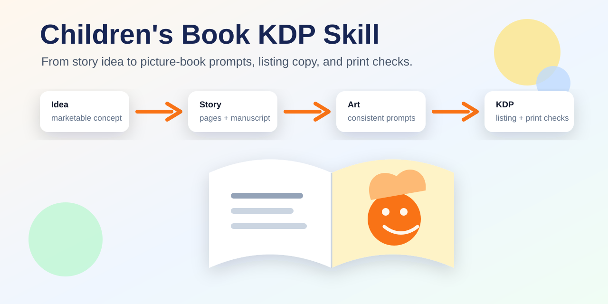
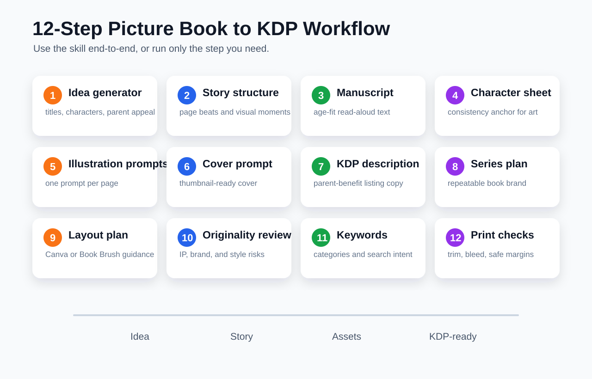
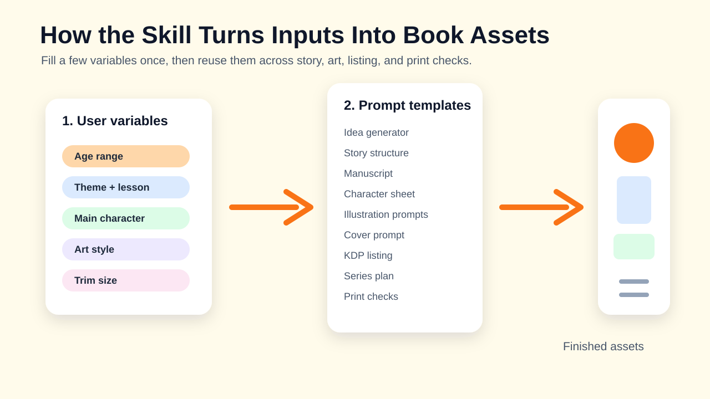
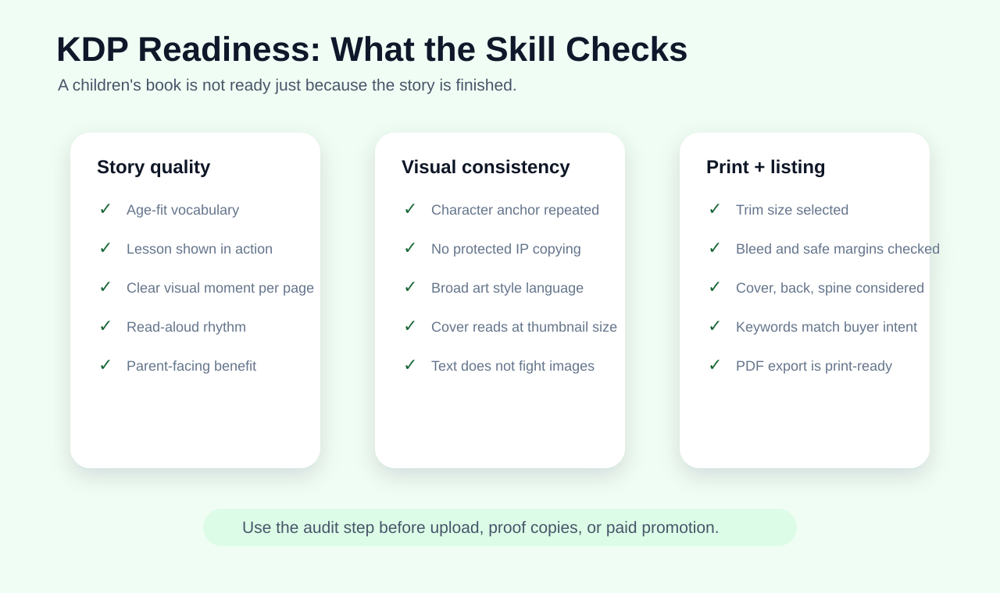

# Children's Book KDP Skill



`children-book-kdp` is a Codex Skill for creating, improving, and packaging children's picture books for Amazon KDP. It turns a rough idea into a structured workflow covering story concept, manuscript, character design, illustration prompts, cover direction, Amazon listing copy, series planning, and print-readiness checks.

## 中文说明

这是一个用于 **儿童绘本 + Amazon KDP 出版流程** 的 Codex Skill。它可以把一个简单选题扩展成完整的绘本生产流程，包括选题、故事结构、手稿、角色设定、逐页插图提示词、封面提示词、Amazon 商品描述、系列化规划、排版建议、原创性风险检查、关键词类目策略、印刷尺寸和出血线检查。

中文用户可以直接这样调用：

```text
使用 $children-book-kdp 帮我做一本 32 页儿童绘本的 KDP 完整流程。

年龄段：4-8 岁
主题：睡前焦虑
教育点：说出自己的感受，会让害怕变小
主角：一只害怕黑暗的小龙
风格：温暖水彩、柔和灯光、适合亲子共读
尺寸：8.5 x 8.5 英寸
```

也可以自然提问：

```text
帮我做一本适合 Amazon KDP 上架的儿童绘本，主题是孩子学习分享。
```

中文详细用法、示例和变量说明见：[references/zh-cn.md](references/zh-cn.md)。

## What This Skill Helps With

- Generate commercial children's picture book ideas.
- Build a page-by-page story structure.
- Write an age-appropriate manuscript.
- Create character sheets for consistent illustrations.
- Generate page illustration prompts for AI image tools.
- Design cover prompts that work at Amazon thumbnail size.
- Write Amazon KDP book descriptions.
- Plan a repeatable book series.
- Prepare layout guidance for Canva, Book Brush, or similar tools.
- Review originality, copyright, trademark, and brand-confusion risks.
- Suggest KDP keywords and category strategy.
- Check trim size, bleed, safe margins, and print-ready PDF issues.

## Repository Structure

```text
children-book-kdp-skill/
  SKILL.md
  README.md
  assets/
    hero.svg
    workflow.svg
    prompt-system.svg
    kdp-checklist.svg
  agents/
    openai.yaml
  references/
    kdp-production-guide.md
    prompt-templates.md
    usage-examples.md
    zh-cn.md
```

## Installation

Copy or clone this repository into your Codex skills directory.

Example:

```bash
git clone https://github.com/liuq413/children-book-kdp-skill.git ~/.codex/skills/children-book-kdp
```

If your Codex skills directory is different, place the repository folder there and keep this structure:

```text
children-book-kdp/
  SKILL.md
  agents/
  references/
```

Restart or refresh Codex after installing the skill if your environment does not load new skills automatically.

## Basic Usage

Invoke the skill explicitly:

```text
Use $children-book-kdp to create a 32-page picture book for ages 4-8 about learning to share.
```

Or ask naturally:

```text
Create a children's picture book for Amazon KDP about a shy moon rabbit learning confidence.
```

The skill should trigger for requests involving children's picture books, KDP children's books, illustrated storybooks, character sheets, page illustration prompts, book cover prompts, Amazon descriptions, series planning, and print-readiness checks.

## Recommended Inputs

You do not need to provide everything at once, but better inputs produce better outputs.

```text
Age range: 4-8
Theme: confidence
Lesson: trying something new even when you feel shy
Main character: a small moon rabbit who collects fallen stars
Page count: 32
Words per page: 20-40
Art style: warm watercolor picture book, soft night colors
Trim size: 8.5 x 8.5 inches
Publishing goal: Amazon KDP paperback
```

## Full Workflow

The skill supports a 12-step pipeline:

1. Idea generator
2. Story structure
3. Manuscript writer
4. Character sheet
5. Illustration prompt generator
6. Cover prompt
7. Amazon KDP description
8. Series expansion
9. Layout plan
10. Originality and rights risk review
11. KDP keywords and categories
12. Print specs and bleed check

For copy-ready prompt blocks, see [references/prompt-templates.md](references/prompt-templates.md).

For KDP production guidance, see [references/kdp-production-guide.md](references/kdp-production-guide.md).

For example requests, see [references/usage-examples.md](references/usage-examples.md).

中文使用说明见 [references/zh-cn.md](references/zh-cn.md)。

## Visual Overview

The skill is designed as a practical production pipeline, not just a prompt collection.



The prompt system reuses a small set of book variables across story, art, listing, and print checks.



KDP readiness includes story quality, visual consistency, listing quality, and print production checks.



## Example Prompts

### Create a Complete Book Pipeline

```text
Use $children-book-kdp to create a complete Amazon KDP workflow for a 32-page children's picture book.

Age range: 4-8
Theme: bedtime anxiety
Lesson: naming your feelings makes them less scary
Main character: a tiny dragon who is afraid of the dark
Art style: cozy watercolor, warm lantern light, gentle expressions
Trim size: 8.5 x 8.5 inches
```

### Generate Only Illustration Prompts

```text
Use $children-book-kdp to create consistent page illustration prompts from this character sheet and story outline.

Character sheet:
[paste character sheet]

Story outline:
[paste page-by-page outline]
```

### Audit a Book Before Upload

```text
Use $children-book-kdp to review my children's picture book for KDP readiness.

Check:
- Age fit
- Manuscript quality
- Illustration consistency
- Originality risks
- Amazon description
- Keywords and categories
- Trim size, bleed, and safe margins
```

## Output Expectations

The skill is designed to produce practical, copy-ready material. Depending on the request, it may output:

- A list of marketable book ideas.
- A page-by-page story outline.
- A full manuscript.
- Character sheets.
- Illustration prompts.
- A cover prompt.
- KDP description copy.
- Keyword and category strategy.
- A series plan.
- A layout checklist.
- A print-readiness audit.

## Publishing Notes

This skill can help with planning, drafting, and quality review, but it does not replace:

- Human editorial review.
- Legal copyright or trademark review.
- Current Amazon KDP policy verification.
- Proof copies and physical print checks.
- Professional design review for final commercial release.

When current Amazon KDP rules, categories, or file requirements matter, verify against the latest official KDP documentation before publishing.

## Design Principles

- Keep the child reader first.
- Show the lesson through story action.
- Make every page visually clear.
- Keep character prompts consistent.
- Write Amazon copy for the parent buyer.
- Avoid protected IP, living-artist imitation, and brand confusion.
- Treat KDP readiness as a production checklist, not just a writing task.
