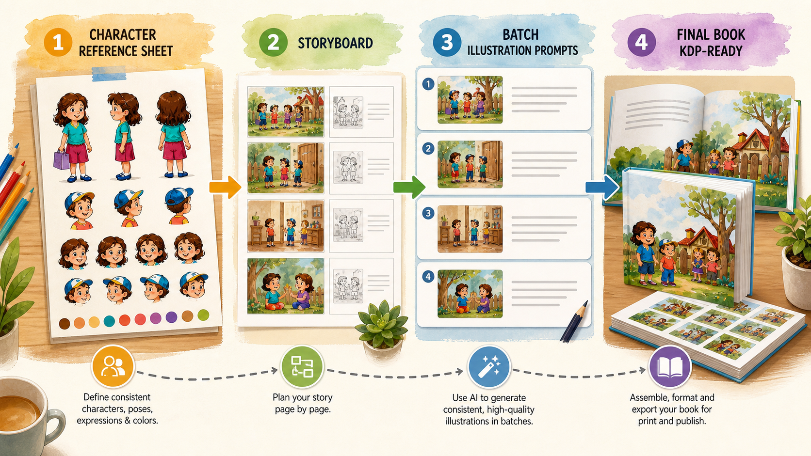
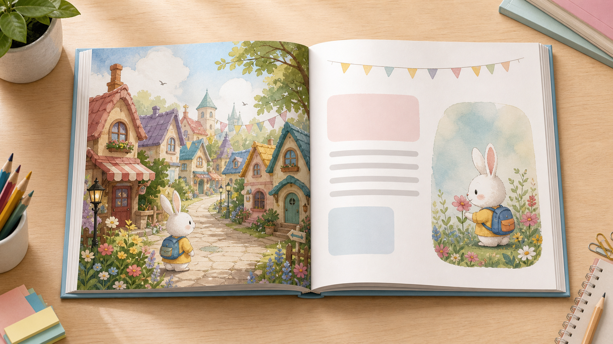
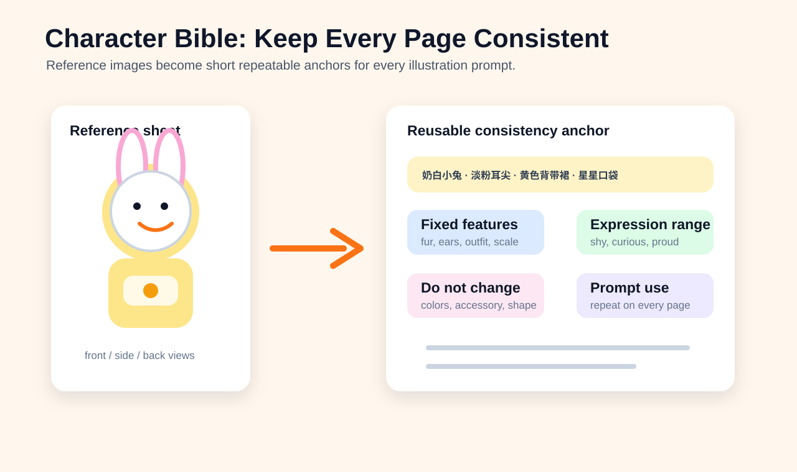
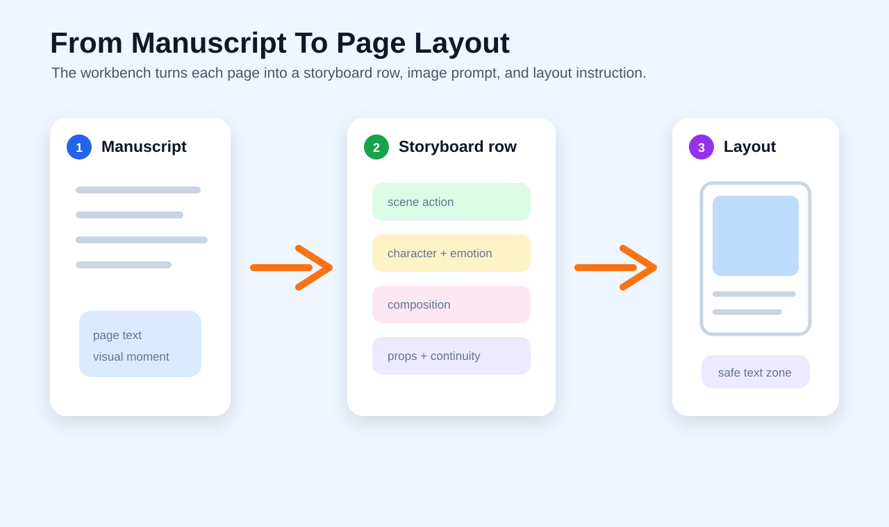

# 中文使用说明

`children-book-kdp` 是一个面向儿童绘本与 Amazon KDP 出版准备的 Codex Skill。它适合用来把一个绘本想法，拆成可执行的创作、插画、上架和印刷检查流程。


## 适合做什么

- 生成儿童绘本选题
- 设计故事结构
- 写逐页绘本文案
- 创建角色设定表
- 生成统一风格的逐页插图提示词
- 生成封面提示词
- 写 Amazon KDP 商品描述
- 规划系列绘本
- 给 Canva、Book Brush 等排版工具提供排版建议
- 检查原创性、版权、商标和品牌混淆风险
- 生成 KDP 关键词和类目策略
- 检查印刷尺寸、出血线、安全边距和 PDF 上传风险

## 推荐调用方式

明确调用：

```text
使用 $children-book-kdp 帮我创建一本儿童绘本的完整 KDP 出版流程。
```

自然调用：

```text
我想做一本儿童绘本并上架 Amazon KDP，主题是孩子学习勇敢表达自己。
```

只做某一步：

```text
使用 $children-book-kdp，只帮我生成角色设定表和逐页插图提示词。
```

## 推荐输入信息

你不一定要一次提供全部信息，但越完整，结果越稳定。

```text
年龄段：4-8 岁
主题：自信
教育点：即使害羞，也可以尝试表达自己
主角：一只收集星星的小月兔
页数：32 页
每页字数：20-40 字
艺术风格：温暖水彩、柔和夜色、亲子共读感
尺寸：8.5 x 8.5 英寸
出版目标：Amazon KDP 平装彩色绘本
```

## 12 步完整流程


1. 选题生成
2. 故事结构
3. 完整手稿
4. 角色设定表
5. 逐页插图提示词
6. 封面提示词
7. Amazon KDP 商品描述
8. 系列化扩展
9. 排版计划
10. 原创性与版权风险检查
11. KDP 关键词与类目策略
12. 印刷规格与出血线检查

## 提示词系统示意


这个 Skill 的核心不是单个万能提示词，而是把一组变量反复复用到不同环节：

- 年龄段
- 主题与教育点
- 主角设定
- 艺术风格
- 尺寸与出版目标

## KDP 检查示意


上架前不要只检查故事是否写完，还要检查角色是否一致、封面是否适合缩略图、关键词是否符合父母搜索意图、PDF 是否满足印刷要求。

## 生产工作台效果示意



这个 Skill 的 v2 版本更适合当作“绘本生产工作台”：先整理角色设定，再做逐页分镜，然后批量生成插图提示词，最后进入排版和 KDP 检查。

## 绘本成品示意



上图展示的是目标成品感：左页可以是完整场景插图，右页可以保留文字区或局部插图区，方便在 Canva 或 Book Brush 中排版。

## 角色一致性示意



如果用户上传角色设定图，Skill 应该先提取固定特征，再生成“角色一致性锚点”，后续每一页插图 Prompt 都重复这个锚点。

## 分镜到排版示意



每页不只是写一句 Prompt，而是拆成：手稿文字、画面动作、角色、情绪、构图、道具、连续性备注、文字摆放区域。

## 完整流程示例

```text
使用 $children-book-kdp，为我创建一本 32 页儿童绘本的完整 Amazon KDP 流程。

年龄段：4-8 岁
主题：睡前焦虑
教育点：说出自己的感受，会让害怕变小
主角：一只害怕黑暗的小龙
每页字数：20-40 字
艺术风格：温暖水彩、柔和灯光、可爱但不幼稚
尺寸：8.5 x 8.5 英寸
目标：生成可用于创作、插画、排版和 KDP 上架准备的一整套内容
```

期望输出结构：

```text
1. 默认假设
2. 书籍概念
3. 逐页故事结构
4. 完整手稿
5. 角色设定表
6. 逐页插图提示词
7. 封面提示词
8. Amazon 商品描述
9. 系列化规划
10. 排版计划
11. 原创性风险检查
12. KDP 上架前检查清单
```

## 单步使用示例

### 只生成选题

```text
使用 $children-book-kdp，为 3-5 岁儿童生成 20 个关于睡前习惯的绘本选题。
每个选题包含标题、主角、教育点、剧情摘要和父母为什么会购买。
```

### 只写手稿

```text
使用 $children-book-kdp，根据下面的故事结构写完整儿童绘本手稿。

年龄段：4-8 岁
语气：温柔、有一点幽默
每页字数：25-45 字

[粘贴逐页故事结构]
```

### 只做角色设定

```text
使用 $children-book-kdp，帮我创建角色设定表。

角色名：诺里
类型：小月兔
年龄感：约 6 岁
性格：害羞、好奇、谨慎、善良
艺术风格：柔和水彩儿童绘本
用途：作为睡前故事系列的主角
```

### 只生成插图提示词

```text
使用 $children-book-kdp，根据角色设定和逐页故事结构，生成整本书的插图提示词。

角色设定：
[粘贴角色设定表]

故事结构：
[粘贴逐页结构]

风格：温暖水彩、柔和纸张纹理、睡前故事氛围
```

### 做 KDP 上架前检查

```text
使用 $children-book-kdp，帮我检查这本儿童绘本是否适合上传 Amazon KDP。

尺寸：8.5 x 8.5 英寸
页数：32 页
内页：彩色
出血：有

[粘贴手稿、封面概念和部分插图提示词]
```

## 中文输出注意事项

- 默认使用用户的语言输出；中文用户应输出中文。
- 儿童绘本文案要短、具体、有画面感，适合亲子共读。
- 教育点最好通过故事行动体现，不要只在结尾说教。
- 插图提示词要重复角色一致性锚点，避免每页角色变样。
- Amazon 商品描述要写给父母看，不只是复述剧情。
- 出版前需要人工校对、版权风险判断、KDP 最新规则核查和实体样书检查。
